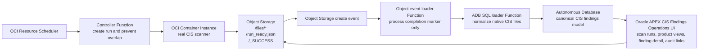

# OCI CIS compliance automation

Code-only deployment repo for an OCI CIS Findings Operations workflow. The solution uses Oracle APEX to assist CIS findings operations: scan-run review, product/compartment views, finding drill-down, audit evidence links, and operational status checks.

## CIS reporting workflow



The scanner image runs Oracle's `cis_reports.py` from the OCI Landing Zones CIS quickstart, preserves the native CIS CSV/HTML/JSON report artifacts in Object Storage, and publishes a run-completion contract using `<run_id>/files/*`, `<run_id>/run_ready.json`, and `<run_id>/_SUCCESS`. The event and SQL loader Functions then normalize the completed run into the ADB canonical CIS findings model, enrich it for product/compartment operations, and keep links back to the original report files so APEX can support operational review and audit evidence from the same source run.

## Contents

- `container/` - Container Instance scanner image.
- `functions/controller/` - Function that creates one Container Instance per scan run.
- `functions/object-storage-event-loader/` - Function triggered by Object Storage create events; it only proceeds on `_SUCCESS` markers.
- `functions/adb-sql-loader/` - Function that loads a completed run into ADB.
- `database/migrations/` - Canonical schema, product mapping, audit views, and APEX support objects.
- `apex/export/` - APEX application export for CIS findings operations, including scan runs, product views, finding detail, and audit evidence links.
- `scripts/` - Build/load helpers, including the ADB deployment package builder.

## Automated deploy

Prerequisites: Terraform/OpenTofu compatible with Terraform `1.5.7+`, OCI CLI credentials, Docker for image builds, and SQLcl for the ADB/APEX install step.

Create `terraform.tfvars`, then log in to OCIR with Docker for the target region key:

```sh
docker login <region-key>.ocir.io
```

Example for `us-ashburn-1` / `iad`:

```sh
docker login iad.ocir.io
```

Then run:

```sh
REGION_KEY=iad \
TENANCY_NAMESPACE=<object-storage-namespace> \
NAME_PREFIX=cis-auto \
TAG=v1 \
APPLY=false \
scripts/deploy_stack.sh
```

With the defaults above, the script initializes Terraform/OpenTofu, runs `plan`, and generates `./build/adb-deploy`. It does not apply Terraform changes or push images.

For first deployment, run the phases explicitly.

Create the four OCIR repositories:

```sh
REGION_KEY=iad \
TENANCY_NAMESPACE=<object-storage-namespace> \
NAME_PREFIX=cis-auto \
TAG=v1 \
BOOTSTRAP_REPOS=true \
APPLY=false \
scripts/deploy_stack.sh
```

Build and push images from a supported image builder. The default images are `linux/amd64`; on Apple Silicon this requires Docker Buildx, otherwise use an AMD/x86 builder such as OCI Cloud Shell or an AMD Linux VM:

```sh
REGION_KEY=iad \
TENANCY_NAMESPACE=<object-storage-namespace> \
NAME_PREFIX=cis-auto \
TAG=v1 \
PUSH_IMAGES=true \
APPLY=false \
scripts/deploy_stack.sh
```

After reviewing the plan and confirming images were pushed, deploy the full stack:

```sh
REGION_KEY=iad \
TENANCY_NAMESPACE=<object-storage-namespace> \
NAME_PREFIX=cis-auto \
TAG=v1 \
APPLY=true \
scripts/deploy_stack.sh
```

To check for a new stable upstream CIS script release in CI:

```sh
python3 scripts/check_latest_cis_release.py
```

That prints `LATEST_VERSION`, the latest GitHub release tag, the pinned raw script URL, and the script SHA-256 for controlled image updates.

## Image build host

The default deployment builds AMD/x86 images for OCI Functions and the E4 scanner Container Instance. On Apple Silicon Macs, Docker must have Buildx enabled to build `linux/amd64` images. If Buildx is not available, run the image build/push step from an AMD/x86 builder such as OCI Cloud Shell or an AMD Linux VM.

The plan-only command does not build images and can run from any machine with Terraform/OpenTofu and OCI CLI credentials.

## Shape and image platform

The default scanner runtime is AMD/x86:

```hcl
container_shape = "CI.Standard.E4.Flex"
```

The Makefile default matches that shape:

```make
RUNNER_PLATFORM ?= linux/amd64
```

To use A1 ARM for lower cost, set `container_shape = "CI.Standard.A1.Flex"` in `terraform.tfvars` and build with `RUNNER_PLATFORM=linux/arm64`.

## Network choices

Function networking, scanner networking, and ADB/APEX networking are separate choices. Functions are always deployed on the supplied private subnet.

| Area | Public option | Private option |
| --- | --- | --- |
| Functions | Not used. Terraform deploys the Function application to `existing_private_subnet_id`. | Required. The subnet must reach OCI Functions dependencies, OCI APIs, OCIR, Object Storage, and ADB. |
| Container Instance scanner | Set `assign_public_ip = true` only when the scanner subnet needs public egress to pull the scanner image and call OCI APIs. | Preferred. Use the same private subnet or set `scanner_subnet_id` to another private subnet with route rules to a NAT gateway for public endpoints and a Service Gateway for Object Storage/Oracle Services Network. Set `assign_public_ip = false`. |
| ADB and APEX | Leave `adb_private_endpoint_subnet_id` empty. ADB is public mTLS-only, and APEX is reachable from the internet subject to ADB/APEX authentication and ACL choices. | Set `adb_private_endpoint_subnet_id`, optional `adb_private_endpoint_nsg_ids`, and optional `adb_private_endpoint_label`. APEX is reachable only from inside the VCN path, such as VPN, FastConnect, bastion/browser host, or peered network. |

For GovCloud or customer-controlled environments, the recommended production posture is: private Function subnet, private scanner subnet with controlled egress, private-endpoint ADB/APEX, mTLS required, private Object Storage bucket, and IAM policies scoped to the deployment compartment plus tenancy read permissions required by the CIS benchmark.

## Private ADB/APEX VPN Access

When ADB is deployed with `adb_private_endpoint_subnet_id`, the ADB SQL endpoint and APEX URL are private. Users and installers must be on a network path that can route to the VCN and resolve the private ADB DNS name.

Customer network requirements:

- VPN, FastConnect, peering, bastion, or admin host route to the VCN CIDR that contains the ADB private endpoint.
- DNS resolution for the private ADB suffix, for example `adb.<region>.oraclecloud.com`.
- Conditional DNS forwarding from customer/VPN DNS to OCI DNS through an OCI DNS Resolver inbound endpoint in the VCN.
- DNS security rules that allow UDP/TCP 53 from the customer DNS resolver or VPN DNS path to the OCI inbound resolver endpoint.
- ADB NSG ingress that allows HTTPS/APEX on TCP 443 from the customer VPN/corporate egress CIDR.
- ADB NSG ingress that allows SQL*Net/mTLS on TCP 1522 from the host running the SQLcl installer.

Example for an ADB private endpoint label `cis-adb` in `us-ashburn-1`:

```text
Private ADB hostname: cis-adb.adb.us-ashburn-1.oraclecloud.com
DNS suffix to forward: adb.us-ashburn-1.oraclecloud.com
Expected resolution: private IP in the ADB subnet, for example 10.120.30.x
```

Validate from the laptop or admin host that will open APEX or run SQLcl:

```sh
nslookup cis-adb.adb.us-ashburn-1.oraclecloud.com
curl -vk https://cis-adb.adb.us-ashburn-1.oraclecloud.com/ords/
```

If `nslookup` returns `NXDOMAIN` or a public resolver answer, VPN routing alone is not enough. Fix private DNS forwarding or run the ADB/APEX install from an OCI admin host inside the VCN.

## Manual fallback

Use the automated deploy phases above for normal installation. Manual Terraform and image commands are only fallback/debug steps if a customer change-control process requires each action to be run separately.

Key manual equivalents:

```sh
terraform init
terraform plan
terraform apply -target=oci_artifacts_container_repository.controller \
  -target=oci_artifacts_container_repository.runner \
  -target=oci_artifacts_container_repository.object_event_loader \
  -target=oci_artifacts_container_repository.adb_sql_loader
make push REGION_KEY=<region-key> TENANCY_NAMESPACE=<namespace> NAME_PREFIX=<name-prefix> TAG=<tag>
terraform apply
```

## ADB and APEX installation

Terraform creates the Autonomous Database, wallet secrets, loader Function configuration, and related IAM. The database schema and APEX application are packaged with the repo so they can be installed after ADB is available.

Automated today:

- `scripts/build_adb_deploy_package.py` generates a single ADB SQL deployment bundle under `./build/adb-deploy`.
- `database/migrations/` contains the canonical CIS findings schema, product mapping model, audit artifact views, and APEX support objects.
- `apex/export/f100_oci_cis_findings_operations_demo.sql` contains the Oracle APEX CIS Findings Operations application export.

SQLcl and Java are required for the automated install path. SQLcl requires Java 11 or newer. Check both before running the installer:

```sh
java -version
which sql
sql -v
```

If SQLcl is installed but not on `PATH`, set `SQL_BIN` to the full SQLcl executable path. With the Homebrew cask on macOS, the path can look like this:

```sh
SQL_BIN=/opt/homebrew/Caskroom/sqlcl/<version>/sqlcl/bin/sql
```

If Java is installed but SQLcl cannot find it, set `JAVA_HOME` first. Example for Homebrew OpenJDK 17 on macOS:

```sh
export JAVA_HOME=/opt/homebrew/opt/openjdk@17/libexec/openjdk.jdk/Contents/Home
export PATH="$JAVA_HOME/bin:$PATH"
```

Private ADB note: if `adb_private_endpoint_subnet_id` is set, the ADB and APEX endpoint is private. Cloud Shell is not inside the customer VCN and normally cannot resolve or reach the private ADB hostname. Run the ADB/APEX install from a host with private network access, such as a laptop on VPN with private DNS working, a bastion/admin host in the VCN, or an approved CI runner in the VCN.

Automated install path after Terraform creates ADB:

First generate a local wallet zip for SQLcl from Cloud Shell or an approved admin host. Use a new wallet password; it does not have to be the ADB admin password.

```sh
oci db autonomous-database generate-wallet \
  --autonomous-database-id $(terraform output -raw autonomous_database_id) \
  --password '<new_wallet_password>' \
  --file ~/Wallet_CISAUTOMATION.zip \
  --region <region>
```

Then run the ADB/APEX install from the host that can reach the ADB endpoint. Prefer prompting for the password so it is not written to shell history:

```sh
read -s ADB_PASSWORD
SQL_BIN=${SQL_BIN:-sql} \
ADB_WALLET_ZIP=~/Wallet_CISAUTOMATION.zip \
ADB_PASSWORD="$ADB_PASSWORD" \
ADB_CONNECT_ALIAS=cisautomation_low \
APEX_WORKSPACE=OCI_CIS_FINDINGS \
APEX_APP_SCHEMA=OCI_CIS_APP \
scripts/deploy_adb_apex.sh
```

The script creates or verifies a locked `OCI_CIS_APP` APEX parsing schema, creates or verifies the `OCI_CIS_FINDINGS` workspace, builds the ADB migration bundle, runs the migrations with SQLcl, imports `apex/export/f100_oci_cis_findings_operations_demo.sql`, and prints the APEX app path. If the ADB hostname is known, also set `APEX_BASE_URL=https://<adb-hostname>` to print the full URL.

If a customer requires manual APEX workspace governance, set `CREATE_APEX_WORKSPACE=false`.

In that mode, the customer must prepare APEX before running the install script:

- Create or choose the APEX workspace, for example `OCI_CIS_FINDINGS`.
- Create or approve the parsing schema, for example `OCI_CIS_APP`.
- Associate the parsing schema with the workspace.
- Confirm the install user, usually `ADMIN`, can import an APEX application into that workspace.

If the customer wants the script to create the locked parsing schema but not the workspace, leave `CREATE_APEX_SCHEMA=true` and set only `CREATE_APEX_WORKSPACE=false`:

```sh
ADB_WALLET_ZIP=/secure/path/Wallet_CISAUTOMATION.zip \
ADB_PASSWORD='<adb_admin_password>' \
ADB_CONNECT_ALIAS=cisautomation_low \
APEX_WORKSPACE=OCI_CIS_FINDINGS \
APEX_APP_SCHEMA=OCI_CIS_APP \
CREATE_APEX_WORKSPACE=false \
scripts/deploy_adb_apex.sh
```

If the customer also creates the parsing schema separately, set both `CREATE_APEX_SCHEMA=false` and `CREATE_APEX_WORKSPACE=false`.

Manual equivalent:

```sh
python3 scripts/build_adb_deploy_package.py --output-dir ./build/adb-deploy
sql -cloudconfig <Wallet_CISAUTOMATION.zip> 'ADMIN/<adb_admin_password>@cisautomation_low' @./build/adb-deploy/phase3_adb_migration_bundle.sql
sql -cloudconfig <Wallet_CISAUTOMATION.zip> 'ADMIN/<adb_admin_password>@cisautomation_low' @apex/export/f100_oci_cis_findings_operations_demo.sql
```

Some APEX first-time setup can still be customer-policy dependent, especially workspace admin users, SSO/password policy, and whether APEX admin APIs are allowed. The automated script handles the standard workspace/parsing-schema path; use `CREATE_APEX_WORKSPACE=false` only when the customer wants those controls performed separately.

## Trigger a scan

Scheduled runs use OCI Resource Scheduler. For an on-demand run, invoke the controller Function:

```sh
export CONTROLLER_FUNCTION_ID=$(terraform output -raw controller_function_id)
export REGION=<region>
scripts/invoke_controller.sh

# Or invoke directly:
oci fn function invoke \
  --function-id <controller_function_ocid> \
  --body '{}' \
  --file /tmp/cis-controller-response.json \
  --region <region>
```

A successful scanner run writes these Object Storage objects:

```text
<run_id>/files/<native CIS report files>
<run_id>/run_ready.json
<run_id>/_SUCCESS
```

The Object Storage event loader receives create-object events for the bucket, ignores ordinary report files, and invokes the ADB SQL loader only when `_SUCCESS` or `_SUCCESS.txt` appears and `run_ready.json` exists.
