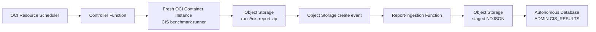

# OCI CIS compliance automation

This Terraform configuration deploys an event-driven CIS reporting workflow:



The runner uses Oracle's `CIS_Report` implementation from the [OCI Landing Zones CIS quickstart](https://github.com/oci-landing-zones/oci-cis-landingzone-quickstart/blob/bc8301a97b25dcef251e9f91042e4c8bea2c7bb6/scripts/cis_reports.py), which is the script linked by the referenced A-Team post. The Docker build pins that exact commit and SHA-256 (`402652…6ae74ee`).

## What this deploys

- OCI Resource Scheduler invokes the controller Function on the configured UTC cron schedule.
- The controller creates a fresh private Container Instance for each scan and skips an overlapping run.
- The Container Instance runs the CIS script with its resource principal, packages all generated files, and writes one report package to Object Storage.
- An Object Storage create event invokes the ingestion Function for each completed `cis-report.zip`. It extracts `cis_summary_report.json`, writes a run-scoped NDJSON staging object, and calls `DBMS_CLOUD.COPY_DATA` in ADB.
- Terraform creates a public, mTLS-only Autonomous Database Serverless instance, Vault and encryption key, a secret for the ADB administrator password, a wallet stored as Vault-secret fragments, three private OCIR repositories, two Functions, an Object Storage event rule, IAM dynamic groups/policies, Function invocation logging, and the schedule.
- The ADB resource principal reads the staged object; no Object Storage credential is stored in the database. The Function retrieves the database password from Vault at runtime, never from Function configuration.
- Terraform does not create any VCN, subnet, gateway, route table, security list, or NSG. It uses the supplied existing network resources.

## Prerequisites

- Terraform 1.6+ and OCI provider credentials with permission to create Functions, Container Instances, Object Storage, Artifact Registry, Events, Vault, Autonomous Database, Resource Scheduler, and IAM resources in the selected compartment.
- Docker with Buildx enabled (Docker Desktop includes it), plus an OCI auth token for pushing to OCIR. The runner is built for ARM64 because it runs on `CI.Standard.A1.Flex`; both Functions are built for AMD64.
- A **dedicated workload compartment**. The CIS runner needs tenancy-wide read/inspect permission for the benchmark, and its dynamic group therefore includes Container Instances in this compartment.
- Existing private networking. Functions and Container Instances need outbound HTTPS access to OCIR, Object Storage, OCI APIs, and the public ADB endpoint—normally through your existing NAT gateway and/or Service Gateway. The ingestion Function uses the mTLS wallet stored in Vault.
- A strong `adb_admin_password`. It is marked sensitive in Terraform, stored in OCI Vault for runtime use, and is still present in Terraform state; use a protected remote backend before production use.

## First deployment

Follow these steps in order. The OCIR repositories must exist and contain images before Terraform can create the Functions.

1. Create `terraform.tfvars` from the example. Set the tenancy and workload-compartment OCIDs, region, OCIR region key, existing private subnet OCID, and a strong ADB administrator password. Set an existing NSG OCID only if your network requires one.

   ```sh
   cp terraform.tfvars.example terraform.tfvars
   ```

2. Initialize Terraform and create the three private OCIR repositories. This targeted apply is only the bootstrap step for a first deployment.

   ```sh
   terraform init
   terraform apply \
     -target=oci_artifacts_container_repository.controller \
     -target=oci_artifacts_container_repository.runner \
     -target=oci_artifacts_container_repository.ingester
   ```

3. Define the OCIR image names. Replace the three placeholder values with the values from `terraform.tfvars` (or use your Object Storage namespace shown in the OCI Console). The image tags below match the Terraform defaults: controller and runner use `v7`; ingester uses `v13`.

   ```sh
   export OCI_REGION_KEY=<region-key>
   export OCI_NAMESPACE=<object-storage-namespace>
   export OCI_NAME_PREFIX=<name-prefix>
   export OCIR_HOST="${OCI_REGION_KEY}.ocir.io"

   export CONTROLLER_IMAGE="${OCIR_HOST}/${OCI_NAMESPACE}/${OCI_NAME_PREFIX}-controller:v7"
   export RUNNER_IMAGE="${OCIR_HOST}/${OCI_NAMESPACE}/${OCI_NAME_PREFIX}-runner:v7"
   export INGESTER_IMAGE="${OCIR_HOST}/${OCI_NAMESPACE}/${OCI_NAME_PREFIX}-ingester:v13"
   ```

4. Log in to OCIR. When prompted, use `<object-storage-namespace>/<OCI-username>` as the username and your OCI auth token as the password. Federated users use `<object-storage-namespace>/<identity-domain>/<OCI-username>`.

   ```sh
   docker login "${OCIR_HOST}"
   ```

5. Build and push the three images. `--load` makes each single-platform Buildx image available to `docker push` locally.

   ```sh
   docker buildx build --platform linux/amd64 --load \
     -t "${CONTROLLER_IMAGE}" functions/controller
   docker push "${CONTROLLER_IMAGE}"

   docker buildx build --platform linux/arm64 --load \
     -t "${RUNNER_IMAGE}" container
   docker push "${RUNNER_IMAGE}"

   docker buildx build --platform linux/amd64 --load \
     -t "${INGESTER_IMAGE}" functions/ingester
   docker push "${INGESTER_IMAGE}"
   ```

6. Create the complete architecture.

   ```sh
   terraform apply
   ```

The default schedule runs at 02:00 UTC every Sunday. Change `schedule_cron` in `terraform.tfvars` before the full apply. The controller's active-run guard skips an overlapping scan rather than starting a second tenancy-wide benchmark. The ADB is public and mTLS-only; Terraform creates no ADB VCN, subnet, NSG, or private endpoint.

## Verify

After the schedule runs, Object Storage contains the immutable source package and the normalized staging object:

```text
runs/<run-id>/cis-report.zip
staged/<run-id>/cis_results.ndjson
```

The archive contains all generated CSV/HTML files and `cis_summary_report.json`. `ADMIN.CIS_RESULTS` contains one row per CIS recommendation, keyed by run ID and recommendation number. `DBMS_CLOUD` records load operations in `USER_LOAD_OPERATIONS`; inspect it from Database Actions when troubleshooting. Container Instance lifecycle records are retained so you can investigate failed runs. Remove old inactive instances using your normal retention process after validating their report packages.

To check the loaded results in Database Actions, sign in as `ADMIN` and run:

```sql
SELECT run_id, recommendation_number, is_compliant, title, compliance_percentage, ingested_at
FROM admin.cis_results
ORDER BY ingested_at DESC, recommendation_number;
```
