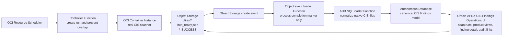

# OCI CIS compliance automation

OCI CIS compliance automation is a Terraform-deployable reference implementation for running OCI CIS scans in Container Instances, preserving native reports in Object Storage, loading normalized findings into Autonomous Database, and using Oracle APEX for scan review, product/compartment analysis, finding drill-down, and audit evidence links.

It packages a Container Instance scanner, controller Function, Object Storage event loader, ADB SQL loader, Autonomous Database schema, Oracle APEX operations UI, Terraform deployment starter, and supporting automation scripts. The project is intended for OCI cloud engineering teams to evaluate CIS findings operations patterns and adapt them into a customer-specific proof of concept.

This repository is a proof-of-concept reference implementation for evaluation purposes. It is not an Oracle product and is not covered by Oracle support.

## CIS reporting workflow



The scanner runs Oracle's `cis_reports.py` from the [OCI Landing Zones CIS quickstart](https://github.com/oci-landing-zones/oci-cis-landingzone-quickstart), preserves the native CIS CSV/HTML/JSON report artifacts in Object Storage, and writes each completed scan run to Object Storage using this layout: `<run_id>/files/*`, `<run_id>/run_ready.json`, and `<run_id>/_SUCCESS`. The event and SQL loader Functions then normalize the completed run into the ADB canonical CIS findings model, enrich it for product/compartment operations, and keep links back to the original report files so APEX can support operational review and audit evidence from the same source run.

## Contents

- `container/` - Container Instance scanner image.
- `functions/controller/` - Function that creates one Container Instance per scan run.
- `functions/object-storage-event-loader/` - Function triggered by Object Storage create events; it only proceeds on `_SUCCESS` markers.
- `functions/adb-sql-loader/` - Function that loads a completed run into ADB.
- `database/migrations/` - Canonical schema, product mapping, audit views, and APEX support objects.
- `apex/export/` - APEX application export for CIS findings operations, including scan runs, product views, finding detail, and audit evidence links.
- `scripts/` - Build/load helpers, including the ADB deployment package builder.

## Automated deploy

Prerequisites: Terraform/OpenTofu compatible with Terraform `1.5.7+`, OCI CLI credentials, Docker or Podman for image builds, and SQLcl for the ADB/APEX install step.

Create `terraform.tfvars`, log in to OCIR for the target region, then run the deployment phases:

```sh
docker login <region-key>.ocir.io
```

Plan only:

```sh
REGION_KEY=<region-key> \
TENANCY_NAMESPACE=<object-storage-namespace> \
NAME_PREFIX=cis-auto \
TAG=v1 \
APPLY=false \
scripts/deploy_stack.sh
```

Create OCIR repositories:

```sh
REGION_KEY=<region-key> \
TENANCY_NAMESPACE=<object-storage-namespace> \
NAME_PREFIX=cis-auto \
TAG=v1 \
BOOTSTRAP_REPOS=true \
APPLY=false \
scripts/deploy_stack.sh
```

Build and push images:

```sh
REGION_KEY=<region-key> \
TENANCY_NAMESPACE=<object-storage-namespace> \
NAME_PREFIX=cis-auto \
TAG=v1 \
PUSH_IMAGES=true \
APPLY=false \
scripts/deploy_stack.sh
```

Deploy the stack after reviewing the plan:

```sh
REGION_KEY=<region-key> \
TENANCY_NAMESPACE=<object-storage-namespace> \
NAME_PREFIX=cis-auto \
TAG=v1 \
APPLY=true \
scripts/deploy_stack.sh
```

The default image platform is `linux/amd64` and the default scanner shape is `CI.Standard.E4.Flex`. Use a compatible builder for the selected platform. To use ARM/A1, set `container_shape = "CI.Standard.A1.Flex"` and build with `RUNNER_PLATFORM=linux/arm64`.

To check for a new stable upstream CIS script release in CI:

```sh
python3 scripts/check_latest_cis_release.py
```

## Network choices

Function networking, scanner networking, and ADB/APEX networking are configured separately:

- Functions deploy to `existing_private_subnet_id`.
- The scanner uses `scanner_subnet_id` when set, otherwise the Function subnet.
- Set `assign_public_ip` according to the approved scanner subnet egress design.
- Set `adb_private_endpoint_subnet_id` to deploy ADB/APEX with private endpoint access.

For GovCloud or customer-controlled environments, use the customer's approved network, IAM, and data-access standards for the deployment compartment and tenancy read permissions required by the CIS benchmark.

## Private ADB/APEX access

When `adb_private_endpoint_subnet_id` is set, ADB SQL access and the APEX URL are private. Customer IT security and network teams should define the approved access path before the ADB/APEX install.

If OCI DNS Resolver support is required, this repository can create an inbound resolver endpoint:

```hcl
create_dns_resolver_inbound_endpoint = true
dns_resolver_endpoint_subnet_id      = "<subnet_reachable_from_customer_dns_or_vpn>"
dns_resolver_endpoint_nsg_id         = "<dns_resolver_nsg_ocid>"
dns_resolver_allowed_cidrs           = ["<customer_dns_or_vpn_cidr>"]
```

After apply, provide this output to the customer networking team if they use conditional DNS forwarding:

```sh
terraform output dns_resolver_inbound_endpoint_ip
```

## ADB and APEX installation

Terraform creates the ADB and OCI runtime resources. After Terraform finishes, run one installer script to create the database objects and import the APEX app.

Required on the machine running the installer: OCI CLI, SQLcl, Java 11 or newer, and network access to the ADB endpoint. For private ADB/APEX deployments, run this from an approved host or network path that can reach the private endpoint.

```sh
read -s ADB_PASSWORD; export ADB_PASSWORD
read -s ADB_WALLET_PASSWORD; export ADB_WALLET_PASSWORD

CREATE_APEX_USER=true \
APEX_USERNAME=<initial_apex_user> \
APEX_USER_EMAIL=<initial_user_email> \
scripts/install_adb_apex_app.sh
```

The script reads the ADB OCID from Terraform output, generates the ADB wallet under `build/wallet/`, installs the schema migrations, imports the APEX application, applies required page overlays, and optionally creates the initial APEX workspace user. If `CREATE_APEX_USER=true`, the script prompts for the initial APEX user password when `APEX_USER_PASSWORD` is not already set.

Use these overrides only when needed:

```sh
REGION=<region> \
ADB_ID=<autonomous_database_ocid> \
ADB_CONNECT_ALIAS=cisautomation_low \
SQL_BIN=/path/to/sql \
JAVA_HOME=/path/to/jdk \
scripts/install_adb_apex_app.sh
```

APEX URL pattern:

```text
https://<adb-apex-hostname>/ords/r/oci_cis_findings/oci-cis-findings-operations/login
```

For advanced or DBA-controlled installs, `scripts/deploy_adb_apex.sh` remains available. It supports separately controlling workspace creation, parsing schema creation, APEX user creation, migrations, app import, and page overlays.

## Product mapping tags

The APEX product views use the normalized CIS finding compartment plus product metadata from OCI tags. For the lowest-maintenance setup, tag product-owning compartments before running the scanner. Tag the root tenancy compartment as the fallback product for root-level CIS findings.

Recommended tag pattern:

```text
Tag namespace: Operations
Tag key: ProductId
Example value: OCI_POC
```

The CIS scanner generates a raw compartment inventory file, `raw_data_identity_compartments.csv`, as part of the native report output. The loader normalizes that CIS output and resolves product ownership in this order:

1. Explicit product mapping override in ADB, when configured.
2. `Operations.ProductId` on the finding compartment.
3. `Operations.ProductId` on the nearest tagged parent compartment.
4. Resource-level product tag, when present in the CIS source data.
5. Unmapped fallback for audit visibility.

A child compartment can override a parent product tag by setting its own `Operations.ProductId`. If no child tag exists, findings inherit the nearest tagged ancestor. After changing product tags, run a new scan so the next run captures the updated compartment/tag snapshot and APEX Product Scorecard reflects the change.

## Trigger a scan

Scheduled runs use OCI Resource Scheduler. For an on-demand run, invoke the controller Function:

```sh
export CONTROLLER_FUNCTION_ID=$(terraform output -raw controller_function_id)
export REGION=<region>
scripts/invoke_controller.sh

# Or invoke directly:
oci fn function invoke \
  --function-id <controller_function_ocid> \
  --body '{}' \
  --file /tmp/cis-controller-response.json \
  --region <region>
```

A successful scanner run writes these Object Storage objects:

```text
<run_id>/files/<native CIS report files>
<run_id>/run_ready.json
<run_id>/_SUCCESS
```

The Object Storage event loader receives create-object events for the bucket, ignores ordinary report files, and invokes the ADB SQL loader only when `_SUCCESS` or `_SUCCESS.txt` appears and `run_ready.json` exists.

## Security

This sample creates OCI IAM policies, Functions, Container Instances, Object Storage, and Autonomous Database resources. Review generated Terraform plans before applying them, scope compartments and dynamic groups for the customer environment, and rotate any setup passwords or auth tokens after deployment.

Do not commit wallet files, Terraform state files, API keys, OCIR auth tokens, or customer CIS report outputs.
