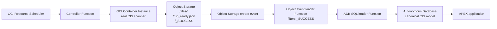

# OCI CIS compliance automation

Code-only deployment repo for an OCI CIS Findings Operations workflow.

## Runtime flow



The scanner image runs Oracle's `cis_reports.py` from the OCI Landing Zones CIS quickstart and writes the same object layout as the Function-based scanner: `<run_id>/files/*`, `<run_id>/run_ready.json`, and `<run_id>/_SUCCESS`.

## Contents

- `container/` - Container Instance scanner image.
- `functions/controller/` - Function that creates one Container Instance per scan run.
- `functions/object-storage-event-loader/` - Function triggered by Object Storage create events; it only proceeds on `_SUCCESS` markers.
- `functions/adb-sql-loader/` - Function that loads a completed run into ADB.
- `database/migrations/` - Canonical schema, product mapping, audit views, and APEX support objects.
- `apex/export/` - APEX application export.
- `scripts/` - Build/load helpers, including the ADB deployment package builder.

## Automated deploy

Create `terraform.tfvars`, then log in to OCIR with Docker for the target region key:

```sh
docker login <region-key>.ocir.io
```

Example for `us-ashburn-1` / `iad`:

```sh
docker login iad.ocir.io
```

Then run:

```sh
REGION_KEY=iad \
TENANCY_NAMESPACE=<object-storage-namespace> \
NAME_PREFIX=cis-auto \
TAG=v1 \
APPLY=false \
scripts/deploy_stack.sh
```

The script initializes Terraform/OpenTofu, bootstraps the four OCIR repositories, builds and pushes the four images, runs `plan`, and generates `./build/adb-deploy` for the database/APEX handoff. Re-run with `APPLY=true` after reviewing the plan.

To check for a new stable upstream CIS script release in CI:

```sh
python3 scripts/check_latest_cis_release.py
```

That prints `LATEST_VERSION`, the latest GitHub release tag, the pinned raw script URL, and the script SHA-256 for controlled image updates.

## Shape and image platform

The default scanner runtime is AMD/x86:

```hcl
container_shape = "CI.Standard.E4.Flex"
```

The Makefile default matches that shape:

```make
RUNNER_PLATFORM ?= linux/amd64
```

To use A1 ARM for lower cost, set `container_shape = "CI.Standard.A1.Flex"` in `terraform.tfvars` and build with `RUNNER_PLATFORM=linux/arm64`.

## Network choices

Function networking, scanner networking, and ADB/APEX networking are separate choices. Functions are always deployed on the supplied private subnet.

| Area | Public option | Private option |
| --- | --- | --- |
| Functions | Not used. Terraform deploys the Function application to `existing_private_subnet_id`. | Required. The subnet must reach OCI Functions dependencies, OCI APIs, OCIR, Object Storage, and ADB. |
| Container Instance scanner | Set `assign_public_ip = true` only when the scanner subnet needs public egress to pull the scanner image and call OCI APIs. | Preferred. Use the same private subnet or set `scanner_subnet_id` to another private subnet with route rules to a NAT gateway for public endpoints and a Service Gateway for Object Storage/Oracle Services Network. Set `assign_public_ip = false`. |
| ADB and APEX | Leave `adb_private_endpoint_subnet_id` empty. ADB is public mTLS-only, and APEX is reachable from the internet subject to ADB/APEX authentication and ACL choices. | Set `adb_private_endpoint_subnet_id`, optional `adb_private_endpoint_nsg_ids`, and optional `adb_private_endpoint_label`. APEX is reachable only from inside the VCN path, such as VPN, FastConnect, bastion/browser host, or peered network. |

For GovCloud or customer-controlled environments, the recommended production posture is: private Function subnet, private scanner subnet with controlled egress, private-endpoint ADB/APEX, mTLS required, private Object Storage bucket, and IAM policies scoped to the deployment compartment plus tenancy read permissions required by the CIS benchmark.

## Manual first deploy

1. Create `terraform.tfvars`.

```sh
cp terraform.tfvars.example terraform.tfvars
```

Set tenancy, compartment, region, OCIR region key, subnet, ADB password, and image tags.

For Gov/private deployments, set:

```hcl
adb_private_endpoint_subnet_id = "<adb-private-endpoint-subnet-ocid>"
adb_private_endpoint_nsg_ids  = ["<optional-nsg-ocid>"]
adb_private_endpoint_label    = "cis-adb"
```

2. Create OCIR repositories first.

```sh
terraform init
terraform apply \
  -target=oci_artifacts_container_repository.controller \
  -target=oci_artifacts_container_repository.runner \
  -target=oci_artifacts_container_repository.object_event_loader \
  -target=oci_artifacts_container_repository.adb_sql_loader
```

3. Build and push images.

```sh
make push REGION_KEY=iad TENANCY_NAMESPACE=<object-storage-namespace> NAME_PREFIX=cis-auto TAG=v1
```

The Makefile builds four images:

```text
<region-key>.ocir.io/<namespace>/<name-prefix>-controller:<tag>
<region-key>.ocir.io/<namespace>/<name-prefix>-runner:<tag>
<region-key>.ocir.io/<namespace>/<name-prefix>-object-event-loader:<tag>
<region-key>.ocir.io/<namespace>/<name-prefix>-adb-sql-loader:<tag>
```

4. Apply the full stack.

```sh
terraform apply
```

5. Install database objects and APEX.

Run the migrations in `database/migrations/` in filename order, then import `apex/export/f100_oci_cis_findings_operations_demo.sql` into the APEX workspace. To generate a single SQL handoff bundle:

```sh
python3 scripts/build_adb_deploy_package.py --output-dir /private/tmp/oci-cis-adb-deploy
```

## Trigger a scan

Scheduled runs use OCI Resource Scheduler. For an on-demand run, invoke the controller Function:

```sh
export CONTROLLER_FUNCTION_ID=$(terraform output -raw controller_function_id)
export REGION=<region>
scripts/invoke_controller.sh

# Or invoke directly:
oci fn function invoke \
  --function-id <controller_function_ocid> \
  --body '{}' \
  --file /tmp/cis-controller-response.json \
  --region <region>
```

A successful scanner run writes these Object Storage objects:

```text
<run_id>/files/<native CIS report files>
<run_id>/run_ready.json
<run_id>/_SUCCESS
```

The Object Storage event loader receives create-object events for the bucket, ignores ordinary report files, and invokes the ADB SQL loader only when `_SUCCESS` or `_SUCCESS.txt` appears and `run_ready.json` exists.
